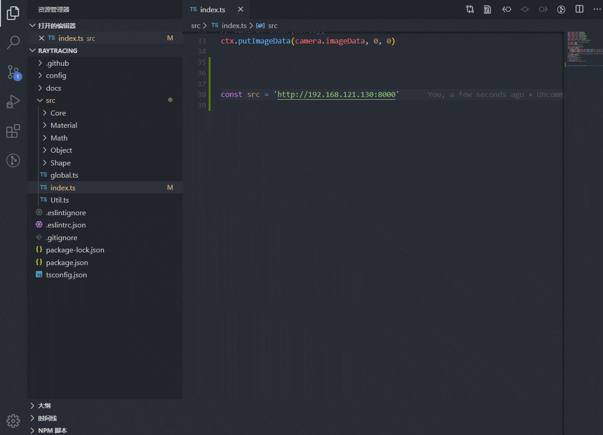
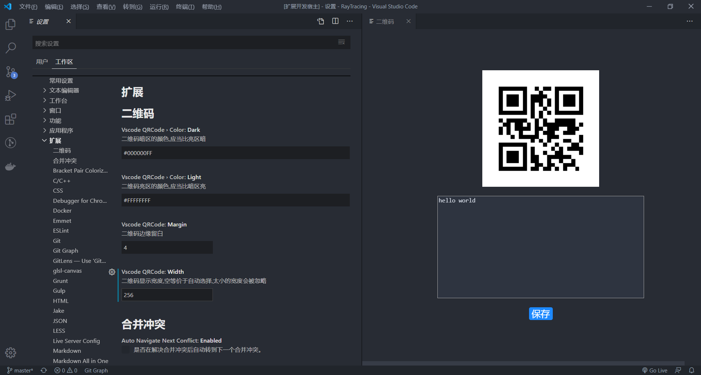

# vscode-qrcode
## 描述
方便地生成和显示二维码,支持将图片保存为`png`或`svg`
## 命令
* `QRCode:预览二维码`:支持文本编辑器右键菜单
  * 示意图
  
## 设置

## 感谢
此插件是基于[qrcode](https://www.npmjs.com/package/qrcode)库开发，感谢它的开发者基于MIT协议分享代码
## 协议
此插件基于[MIT](LICENSE)协议进行授权
## 注意
vscode刚打开时就打开二维码界面容易出现画面崩坏,可以先关闭界面等vscode加载完所有插件后再运行命令